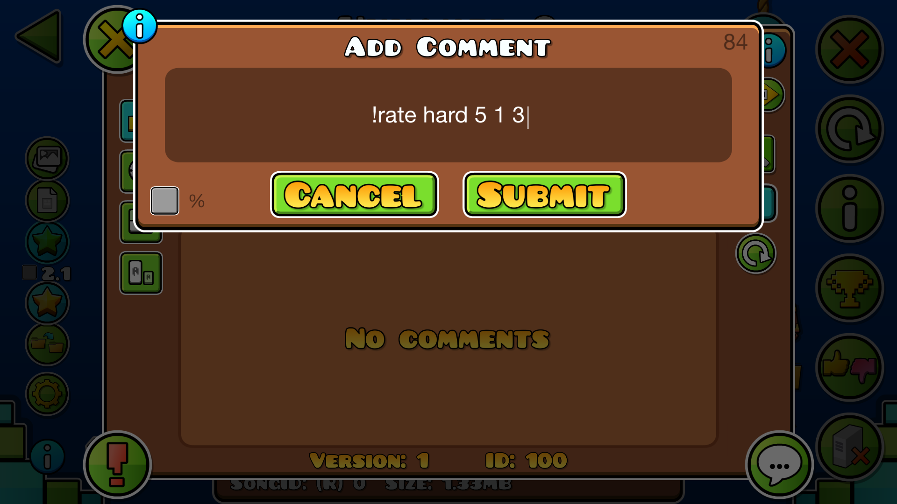
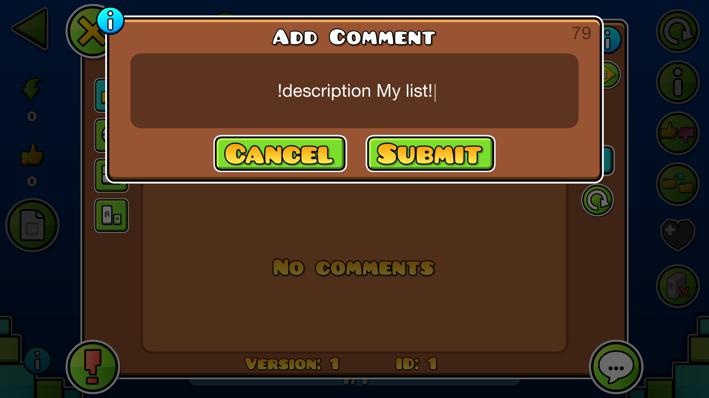
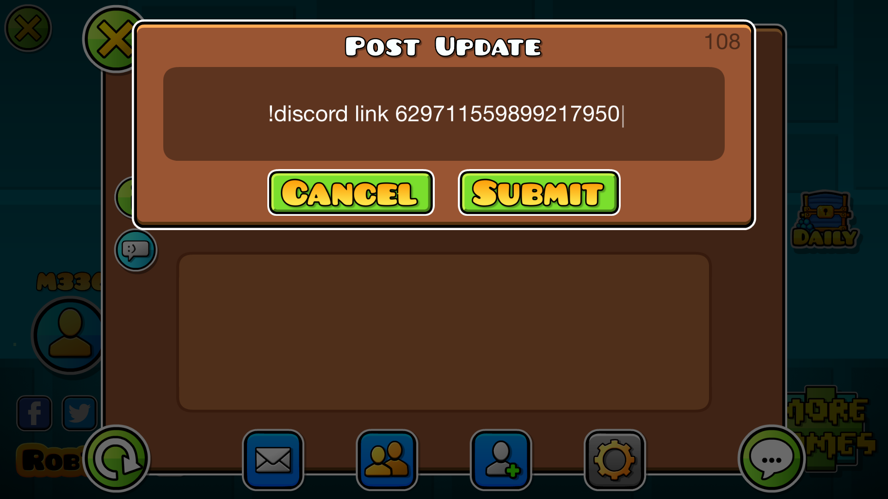

These are all the commands available on a GDPS using [MegaSa1nt's GMDprivateServer fork](https://github.com/MegaSa1nt/GMDprivateServer/tree/master)!

*Some commands have optional arguments not listed here for simplicity.*

## Level Commands
These commands can be used in a level's comment section!

### Rating
| Command | Permission | Description |
| --- | --- | --- |
| `!rate` / `!r <difficulty> <stars> <coins> <feature>` | `commandRate` | Rates the level. `difficulty`: `auto`, `easy`, `normal`, `hard`, `harder`, `insane`, or `demon`. `coins`: `1` = on, `0` = off. `feature`: `0` = rated only, `1` = featured, `2` = epic, `3` = legendary, `4` = mythic. |
| `!unrate` / `!unr` | `commandRate` | Unrates the level completely. |
| `!send <difficulty> <stars> <feature>` | `actionSuggestRating` | Sends the level for rating. `difficulty`: `auto`, `easy`, `normal`, `hard`, `harder`, `insane`, or `demon`. `feature`: `0` = rated only, `1` = featured, `2` = epic, `3` = legendary, `4` = mythic. |
| `!unsend` | `actionSuggestRating` | Unsends the level completely. |

### Feature
| Command | Permission | Description |
| --- | --- | --- |
| `!feature` / `!f` | `commandFeature` | Features the level. |
| `!epic` | `commandEpic` | Makes the level epic. |
| `!legendary` | `commandEpic` | Makes the level legendary. |
| `!mythic` | `commandEpic` | Makes the level mythic. |
| `!unfeature` | `commandFeature` | Removes feature. |
| `!unepic` | `commandEpic` | Removes epic. |
| `!unlegendary` | `commandEpic` | Removes legendary. |
| `!unmythic` | `commandEpic` | Removes mythic. |

### Daily
| Command | Permission | Description |
| --- | --- | --- |
| `!daily` / `!da` | `commandDaily` | Sets the level as the next daily. |
| `!weekly` / `!w` | `commandWeekly` | Sets the level as the next weekly. |
| `!event` / `!ev <minutes> <reward ID> <amount>` | `commandEvent` | Sets the level as the next event for the specified duration. Add multiple rewards: `!event <minutes> <reward ID> <amount> <reward ID> <amount>...` [Reward IDs](#rewards). |

### Coins & Creator Points
| Command | Permission | Description |
| --- | --- | --- |
| `!verifycoins` / `!vc` | `commandVerify` | Verifies the level's coins. |
| `!unverifycoins` | `commandVerify` | Unverifies the level's coins. |
| `!sharecp <username>` | `commandSharecpOwn` / `commandSharecpAll` | Shares the level's creator points with another user. |

### Management
| Command | Permission | Description |
| --- | --- | --- |
| `!setacc` / `!sa <username/account ID>` | `commandSetacc` | Changes the level's creator. |
| `!lockUpdating` / `!lu` | `commandLockUpdating` | Prevents the creator from updating the level. |
| `!unlockUpdating` / `!unlu` | `commandLockUpdating` | Allows the creator to update the level again. |
| `!rename` / `!re <name>` | `commandRenameOwn` / `commandRenameAll` | Renames the level. |
| `!description` / `!desc <description>` | `commandDescriptionOwn` / `commandDescriptionAll` | Changes the level's description. |
| `!song` / `!s <song ID>` | `commandSongOwn` / `commandSongAll` | Changes the level's song. |
| `!public` / `!pub` | `commandPublicOwn` / `commandPublicAll` | Makes the level public. |
| `!unlist` | `commandUnlistOwn` / `commandUnlistAll` | Makes the level unlisted. |
| `!ldm` | `commandLdmOwn` / `commandLdmAll` | Enables LDM on the level. |
| `!unldm` | `commandLdmOwn` / `commandLdmAll` | Disables LDM on the level. |
| `!password` / `!pass` / `!p <6 digits>` | `commandPassOwn` / `commandPassAll` | Sets the level's copy password. Submit `000000` to remove it. |
| `!lockComments` / `!lc` | `commandLockCommentsOwn` / `commandLockCommentsAll` | Locks comments on the level. |
| `!unlockComments` / `!unlc` | `commandLockCommentsOwn` / `commandLockCommentsAll` | Unlocks comments on the level. |
| `!delete` / `!delet` / `!d` | `commandDelete` | Deletes the level. |

## List Commands
These commands can be used in a list's comment section!

### Rating & Feature
| Command | Permission | Description |
| --- | --- | --- |
| `!rate` / `!r <reward> <difficulty> <featured> <count>` | `commandRate` | Rates the list. `difficulty`: `auto`, `easy`, `normal`, `hard`, `harder`, `insane`, or `demon`. `featured`: `0` = rated only, `1` = featured. `count`: levels required to beat for rewards. With only `actionSuggestRating`, it suggests it instead. [Reward IDs](#rewards). |
| `!feature` / `!f` | `commandFeature` | Features the list. |
| `!unfeature` | `commandFeature` | Removes feature. |

### Management
| Command | Permission | Description |
| --- | --- | --- |
| `!rename` / `!re <name>` | `commandRenameOwn` / `commandRenameAll` | Renames the list. |
| `!description` / `!desc <description>` | `commandDescriptionOwn` / `commandDescriptionAll` | Changes the list's description. |
| `!setacc` / `!sa <username/account ID>` | `commandSetacc` | Changes the list's creator. |
| `!unlist` | `commandUnlistOwn` / `commandUnlistAll` | Makes the list unlisted. Use `!unlist 0` for public, `!unlist 1` for friends-only. |
| `!lockComments` / `!lc` | `commandLockCommentsOwn` / `commandLockCommentsAll` | Locks comments on the list. |
| `!unlockComments` / `!unlc` | `commandLockCommentsOwn` / `commandLockCommentsAll` | Unlocks comments on the list. |
| `!delete` / `!d` | `commandDelete` | Deletes the list. |

## Profile Commands
These commands can be used under your profile's comment section! Only works if the GDPS supports linking Discord accounts.

| Command | Description |
| --- | --- |
| `!discord link <discord ID>` | Starts the linking process and sends a 4-digit code to your DMs. |
| `!discord accept <code>` | Links your profile to your Discord account if the code is valid. |
| `!discord unlink` | Unlinks your profile from your Discord account. |

## Rewards
These are the IDs for each reward type.

### Shard Rewards
| ID | Reward |
| --- | --- |
| **1** | Fire Shard |
| **2** | Ice Shard |
| **3** | Poison Shard |
| **4** | Shadow Shard |
| **5** | Lava Shard |
| **10** | Earth Shard |
| **11** | Blood Shard |
| **12** | Metal Shard |
| **13** | Light Shard |
| **14** | Soul Shard |

### Icon Rewards
| ID | Reward |
| --- | --- |
| **1001** | Cube |
| **1002** | Color 1 |
| **1003** | Color 2 |
| **1004** | Ship |
| **1005** | Ball |
| **1006** | UFO |
| **1007** | Wave (Dart) |
| **1008** | Robot |
| **1009** | Spider |
| **1010** | Trail |
| **1011** | Death Effect |
| **1013** | Swing |
| **1014** | Jetpack |
| **1015** | Ship fire |

### Other Rewards
| ID | Reward |
| --- | --- |
| **6** | Demon Key |
| **7** | Orbs |
| **8** | Diamond |
| **15** | Gold Key |
| **1012** | Items (keys, paths, gems, music hack, etc.) |

-----

*Last updated: July 14th, 2026*