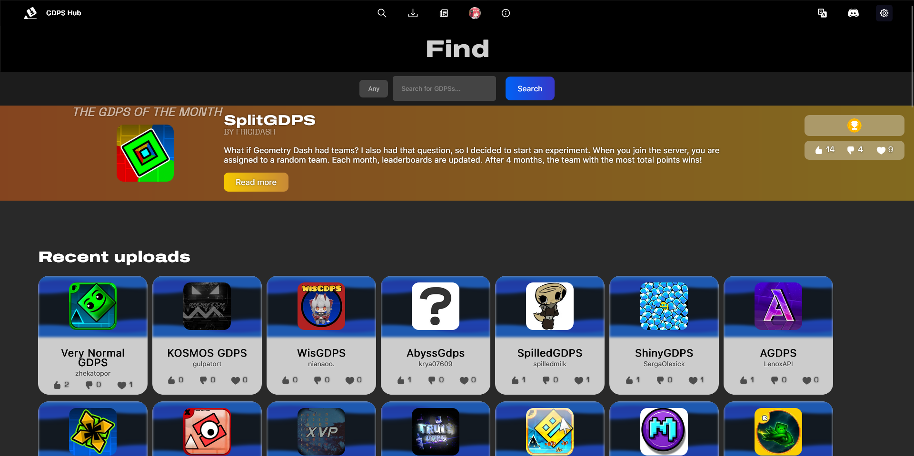

If you're thinking this guide will give you a quick and simple way to grow your GDPS super easily, stop right there. While there are a lot of ways to grow your GDPS, it only matters if consistency, time, and effort are put into it. If your GDPS is just a generic GDPS like any other, find stuff to make it stand out first.

## Growing your GDPS
Here are some ways for you to grow your GDPS further and reach a wider audience:
- **Social media:** This is probably the most popular option, but that doesn't make it an easy one. Nowadays, social media (mostly referring to YouTube, TikTok, & Instagram here) are filled with Geometry Dash content, so if you're looking for a way to advertise your GDPS on there, think first: "How could I create content for my GDPS that's unique enough for people to notice it? What do I need to do in order to keep people watching the content I publish?" It certainly isn't easy at first, but make sure to maintain consistency with your upload schedule and to post often!
- **Modding:** This is one of the most efficient ways to make your GDPS stand out. Adding new features to your GDPS that almost no one has seen before helps a ton, and even making the game's UI much nicer overall will attract more people to your GDPS.
- **GDPS Hub:** Posting your GDPS on [GDPS Hub](https://gdpshub.com/) is usually one of the main ways to help people discover your GDPS online (outside of Discord, basically). If your GDPS is original enough to be designated as the GDPS of the Month, it can also bring huge attention to it for that time period!
- **Lists:** A lot of people are looking for GDPSs where they can beat hard levels and stay competitive with others when they couldn't on the normal Geometry Dash servers due to the immense skill level that's needed to even enter the top players leaderboard. Having lists also helps others notice cool levels on your GDPS before they even join, and players posting verifications/new records on YouTube can give passive attraction to your GDPS too!
- **Contests:** Contests are a great way to attract creators to your GDPS, and even more so if they grant good rewards (such as Discord Nitro, Steam cards, etc.). Of course, you are not obligated to spend money to reward contest winners, but it is usually something that boosts their motivation and attraction to your GDPS quite a bit.
- **Advertising channels:** Even if it may be one of the easiest and perhaps one of the most inefficient ways to advertise your GDPS due to the amount of people doing it every day, it's always a little plus to not forget to post your GDPS advertisement every X period!

And remember, growing your GDPS almost always takes a **lot** of time. Don't give up and always try to find ways to grow it further, even if it takes weeks, months, or even years.

## Maintaining your GDPS' playerbase
Finding ways to grow and advertise your GDPS is great, but if you don't find ways to maintain its playerbase, players will find alternatives and it will eventually die. Therefore, here are some ways for you to keep the playerbase engaged on your GDPS:
- **Events:** This doesn't particularly have to be an event on a GDPS; events where players can join a Minecraft server with a cool concept or just play Among Us in a big voice chat are a great idea to keep the playerbase involved in the GDPS.
- **Lists:** Even though I mentioned it before, lists are a great way to generate passive attraction to your GDPS. Players will continue creating harder and harder levels, and people will also continue trying to beat them and climb higher and higher on the lists' leaderboards.
- **New Features:** If you are modding your GDPS, regularly adding new cool features and teasing your players about upcoming ones is a great way to keep them on the GDPS.
- **Leveling:** Having an XP bot on your GDPS' Discord server can encourage players to keep talking to gain more and more XP and increase their placement on the leaderboards.

And finally, don't forget to listen to your own community! An owner who actively listens to their community to improve their GDPS will always be seen in a much better light than one who doesn't listen at all.

*Looking at statistics can also help a ton. Try to frequently check your statistics endpoint over `dashboard/api/stats.php` :)*

## Special Thanks
I would like to thank [Izumi from GD Lightsync](https://discord.gg/mvbjWdC6cF) & [Cirno from 1.3 GDPS](https://onepointthree.app/) for answering my questions to write this guide!

-----

*Last updated: July 14th, 2026*