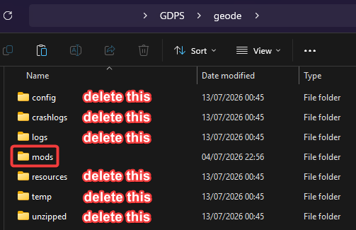
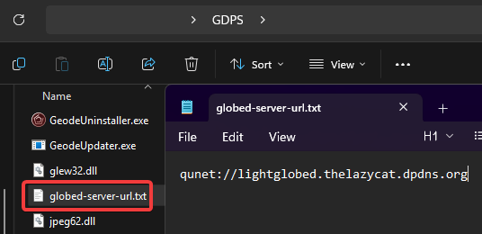
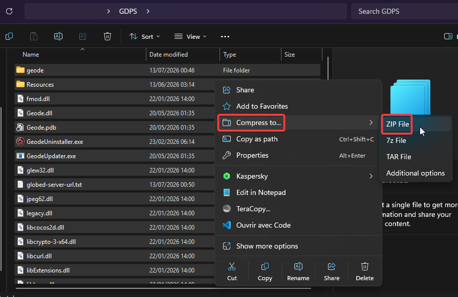

Not sure where to upload your GDPS files or if you're setting them up correctly? This guide gives you some tips on how to upload your GDPS files the right way!

## Tips for PC versions
While making the archive for your GDPS' PC version, there is a good amount of stuff not to miss to avoid adding unnecessary file size. If you pre-install Geode, only include the `mods` and `resources` folders inside the `geode` folder.

### For GDPSs with Globed servers
If you have a custom Globed server, you can create a `globed-server-url.txt` file containing the URL to your Globed server in the root directory of your GDPS (where your .exe is located) so that players don't have to enter it manually!

Once you're done with all of the above, select all files & folders inside your GDPS folder (**not** the GDPS folder itself) and compress them.

## Uploading your GDPS files
Many people struggle to find a good free & permanent file host so here's a list (from most recommended to least recommended):
- [Catbox](https://catbox.moe/) (max 200 MB)
- [Pillowcase](https://pillows.su/) (max 200MB, 500MB if logged in)
- [Google Drive](https://drive.google.com/) (max 15GB but leaks your name/email. Also check this: https://sites.google.com/site/gdocs2direct/)
- [Mediafire](https://www.mediafire.com/) (max 4GB)
- [MEGA](https://mega.io/) (max 20GB)
- [Dropbox](https://www.dropbox.com/) (max 2GB)

-----

*Last updated: July 13th, 2026*