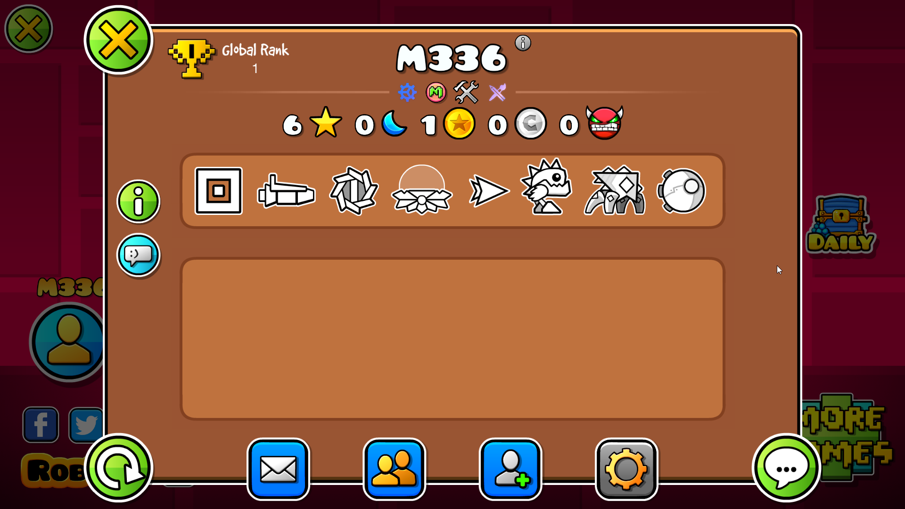
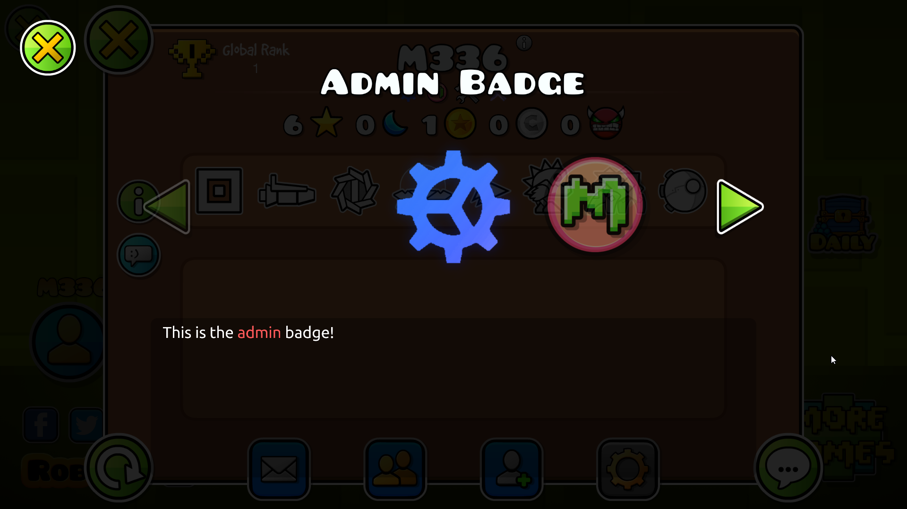
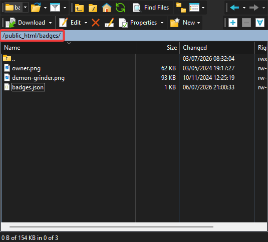
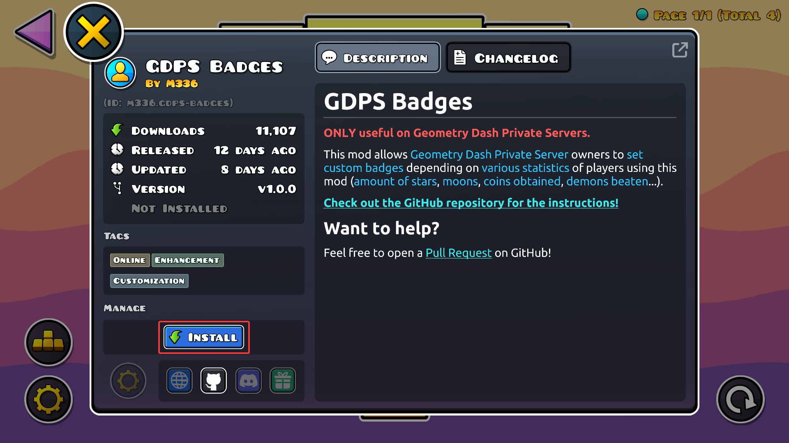

Ce guide vous montrera comment ajouter des badges personnalisés en jeu pour les joueurs de votre GDPS en utilisant le mod [GDPS Badges](https://geode-sdk.org/mods/m336.gdps-badges) !





*Ce guide s'adresse principalement aux propriétaires et administrateurs de GDPS. Si vous êtes un simple joueur, attendez que le GDPS sur lequel vous jouez annonce sa compatibilité avec ce mod pour voir les badges en jeu.*

## Prérequis
Pour suivre ce guide, vous aurez besoin de :

- Un accès complet au SFTP de votre GDPS
- Quelques badges déjà créés (après tout, c'est le but de ce guide.. non ? *Résolution recommandée : 92×92, au format PNG uniquement*)

## Créer badges.json
Dans votre client SFTP, rendez-vous dans le dossier racine public de votre serveur web (généralement `public_html`), et créez un dossier nommé `badges`. C'est là que vous définirez les propriétés de chaque badge et stockerez leurs textures.

Dans le dossier `badges`, créez un fichier `badges.json` et remplissez-le selon l'exemple ci-dessous :

```json
[
    {
        "id": "owner",
        "name": "Owner",
        "description": "C'est le <cr>propriétaire</c> de ce GDPS !",
        "requirements": {
            "players": [ 72 ]
        }
    },
    {
        "id": "demon-grinder",
        "name": "Demon Grinder",
        "description": "Ce joueur a battu plus de <cr>2 500</c> niveaux démons !",
        "requirements": {
            "minDemons": 2500,
            "maxDemons": 9999
        }
    }
]
```

### Prérequis possibles
| Propriété | Description | Exemple |
| --- | --- | --- |
| `players` | Liste blanche des IDs de compte qui auront le badge | `"players": [ 72, 73, 74 ]` |
| `modBadge` | Ajoute le badge si le joueur possède un badge de modérateur. Soit `leaderboard`, `elder` ou `regular` | `"modBadge": "elder"` |
| `minRank` | Rang global minimum requis | `"minRank": 1` |
| `maxRank` | Rang global maximum autorisé | `"maxRank": 100` |
| `minStars` | Nombre d'étoiles minimum requis | `"minStars": 1000` |
| `maxStars` | Nombre d'étoiles maximum autorisé | `"maxStars": 5000` |
| `minMoons` | Nombre de lunes minimum requis | `"minMoons": 500` |
| `maxMoons` | Nombre de lunes maximum autorisé | `"maxMoons": 2000` |
| `minGoldCoins` | Nombre de pièces secrètes minimum requis | `"minGoldCoins": 50` |
| `maxGoldCoins` | Nombre de pièces secrètes maximum autorisé | `"maxGoldCoins": 164` |
| `minSilverCoins` | Nombre de pièces utilisateur minimum requis | `"minSilverCoins": 100` |
| `maxSilverCoins` | Nombre de pièces utilisateur maximum autorisé | `"maxSilverCoins": 500` |
| `minDemons` | Nombre minimum de démons battus requis | `"minDemons": 10` |
| `maxDemons` | Nombre maximum de démons battus autorisé | `"maxDemons": 100` |

## Ajouter les textures des badges
Glissez simplement les textures de vos badges dans le dossier `badges`.
Assurez-vous qu'elles portent le même nom que l'ID défini pour chaque badge dans `badges.json` !

Par exemple, pour ajouter la texture du badge Demon Grinder ci-dessus, ajoutez un fichier nommé `demon-grinder.png`.


## Partager le mod
Il ne vous reste plus qu'à informer vos joueurs que votre GDPS est compatible avec le mod :
- En le [téléchargeant manuellement](https://geode-sdk.org/mods/m336.gdps-badges) et en le glissant dans le dossier des mods de Geode
- Ou, en jeu, en le téléchargeant **depuis l'index** comme montré ci-dessous :


-----

*Dernièrement mis à jour : 15 Juillet 2026*