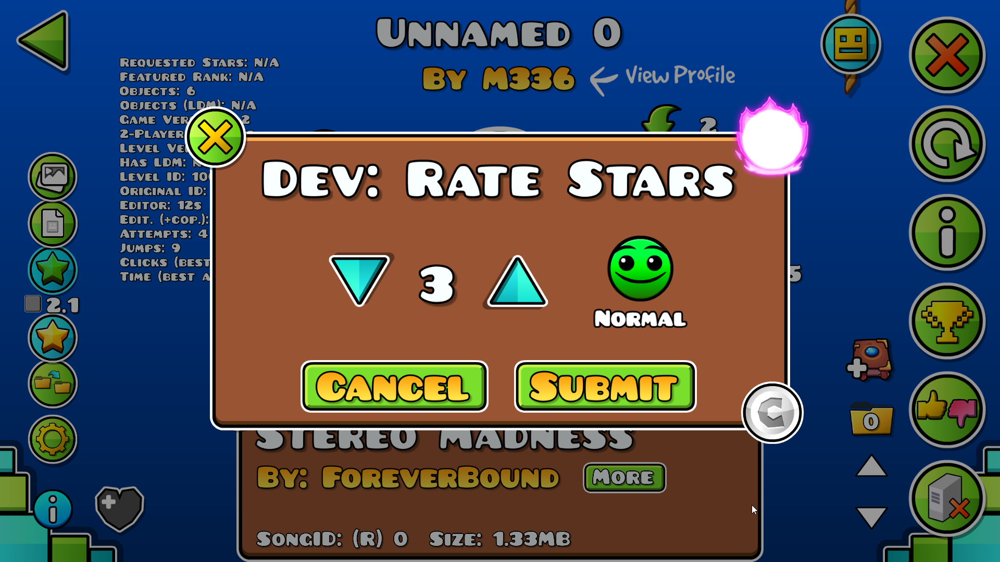
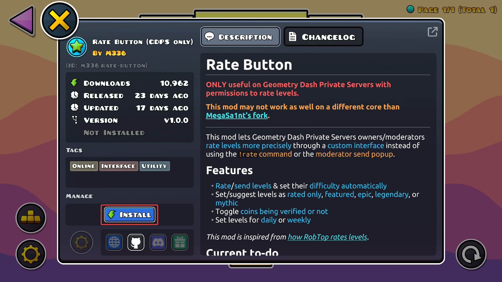
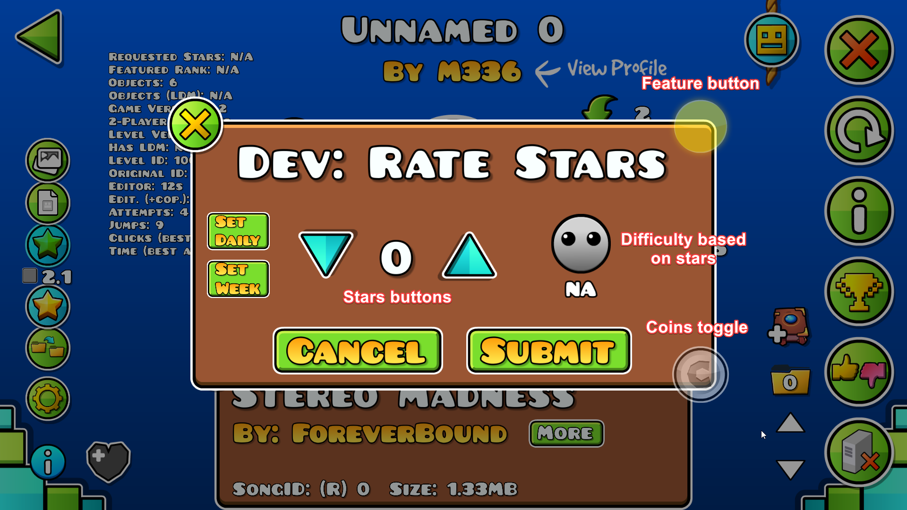
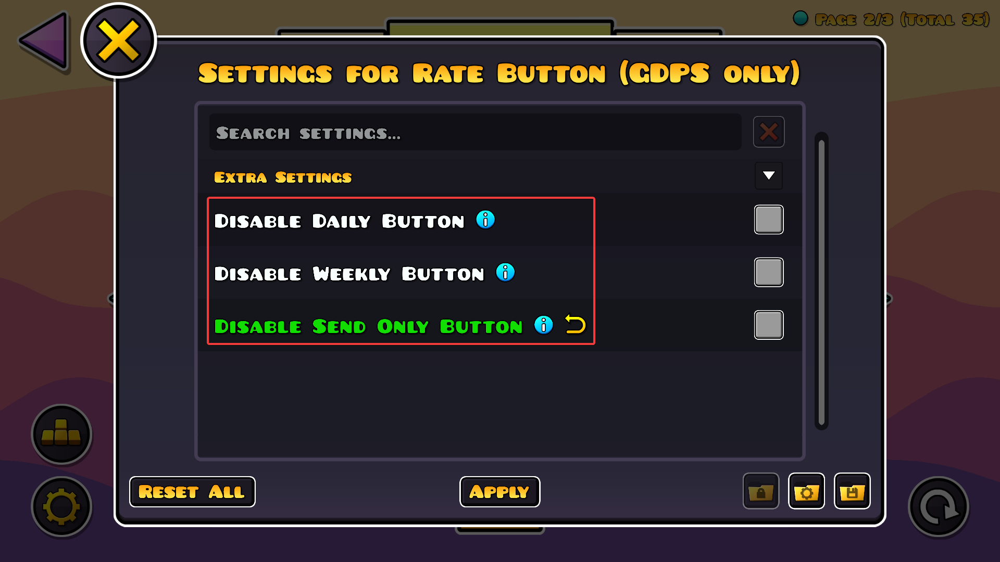

Ce guide vous montrera comment obtenir une interface un peu [comme celle que RobTop utilise](https://www.youtube.com/watch?v=_wmWuymEZDs) pour rate des niveaux sur un GDPS grâce à un mod Geode !

## Introduction
À noter que ce mod n'est pas simplement limité à rate des niveaux ; il a aussi été créé pour :
- Rate des niveaux sans galérer à trouver quelles permissions sont requises ; en interne, il utilise les commandes `!rate` et `!unrate`, mais il rajoute une jolie interface par-dessus !
- Être utilisable sans avoir besoin de badge Modérateur ou cliquer sur le bouton "Req." dans les paramètres du jeu. Vous n'avez besoin que de la [permission requise par le mod](#prérequis). *Ça vous permet aussi de rate des niveaux même si vous avez le badge Leaderboard Moderator !*
- Être aussi intuitif que possible : chaque bouton va droit au but, sans aucun sens caché

## Prérequis
Pour pouvoir suivre le reste de ce guide, vous devrez vous assurer que :
- Vous êtes sur un GDPS (*[GDPS Switcher](https://geode-sdk.org/mods/km7dev.gdps-switcher) marche aussi*)
- Vous avez la permission `commandRate` activée *(oui.. c'est tout)*
- Vous utilisez [Geode v5.7.1 ou plus](https://geode-sdk.org/install)

## Installer le mod
L'installation du mod en elle-même est plutôt simple !
- [Téléchargez-le manuellement](https://geode-sdk.org/mods/m336.rate-button) et glissez-le dans le dossier mods de Geode,
- Ou, en jeu, téléchargez-le **depuis l'index** comme montré ci-dessous :

## Utiliser le mod
Après avoir téléchargé le mod et redémarré le jeu, vous verrez un nouveau bouton bleu apparaître lorsque vous cliquez sur un niveau. Ce dernier ouvre l'interface pour rate un niveau !
- Cliquer sur les flèches **bas** et **haut** permet de **diminuer** ou d'**augmenter** le **nombre d'étoiles** que le niveau aura (sa difficulté sera automatiquement sélectionnée en fonction du nombre d'étoiles)
- Cliquer sur le **bouton feature** détermine si le niveau est uniquement **rated**, **featured**, **epic**, **legendary** ou **mythic**
- Cliquer sur le **bouton pièces** permet d'**activer** ou de **désactiver** la **collecte des pièces**

*Si vous mettez le nombre d'étoiles à 0 et que vous cliquez sur Submit, ça unratera complètement le niveau, même si vous avez sélectionné une feature ou (dé)activé la collecte des pièces.*

## Fonctionnalités supplémentaires
Dans les paramètres du mod, vous pouvez aussi activer/désactiver ces boutons :
- Le bouton **Set Daily** vous permet de faire du niveau le prochain niveau journalier (nécessite la permission `commandDaily`)
- Le bouton **Set Week** vous permet de faire du niveau le prochain niveau hebdomadaire (nécessite la permission `commandWeekly`)
- Le bouton **Send Only** vous permet de simplement suggérer le niveau à la place de le rate (nécessite la permission `actionSuggestRating`)

-----

*Dernièrement mis à jour : 12 Juillet 2026*