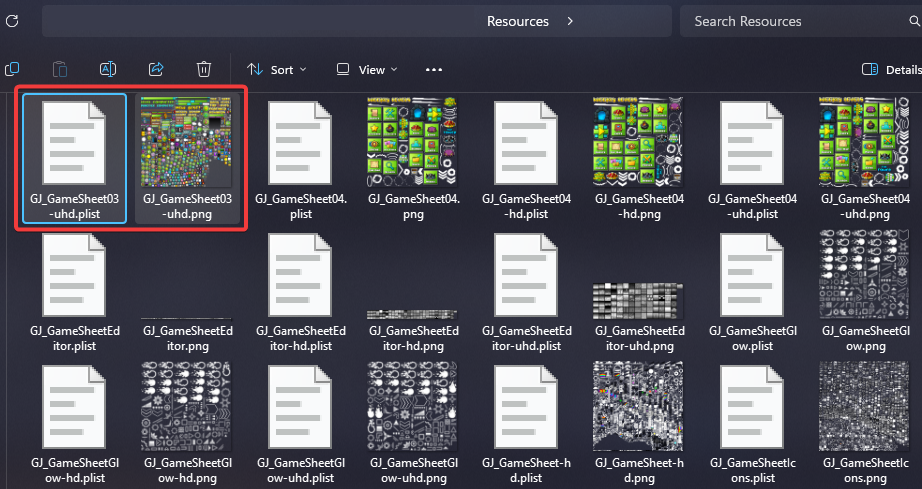
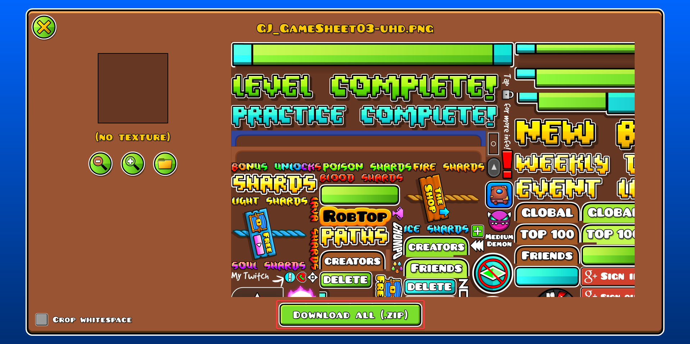
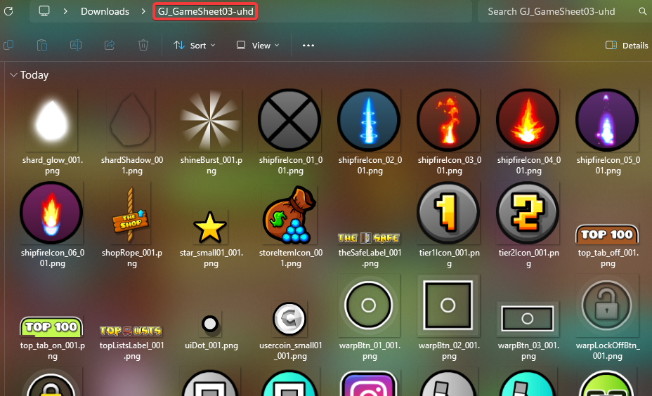
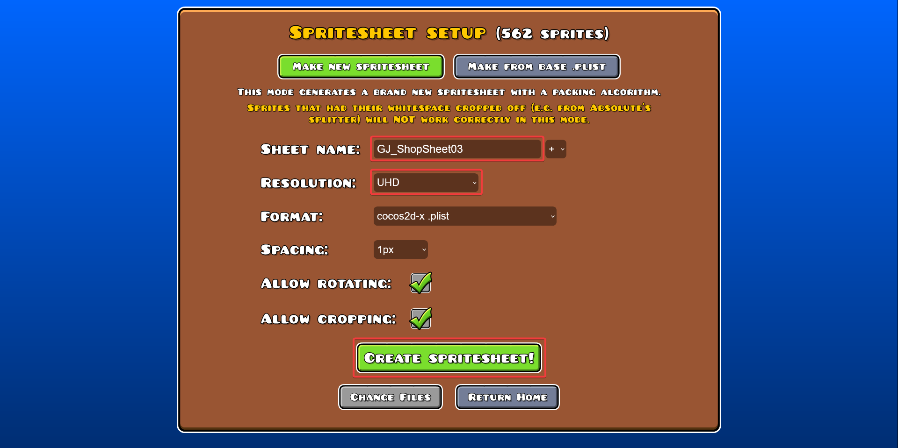

Vous ne savez pas comment modifier les textures de votre GDPS ? Ce guide vous montrera comment faire !

***Ce guide ne vous montre PAS comment designer des textures !***

## Prérequis
Pour pouvoir suivre le reste de ce guide, vous devez vous assurer que :
- Vous avez un éditeur d'images (comme [Photoshop](https://www.adobe.com/products/photoshop.html), [Pixlr](https://pixlr.com/), [ibisPaint X](https://ibispaint.com/productWin.jsp), [Krita](https://krita.org/), [GIMP](https://www.gimp.org/)...)
- Vous avez les textures/spritesheets de base du jeu

## Trouver les textures
Allez dans le dossier `Resources` de votre GDPS et trouvez les textures que vous voulez modifier. Vous verrez que la plupart d'entre elles se trouvent dans un énorme fichier contenant beaucoup d'autres textures ; ça s'appelle une spritesheet.

Chaque texture dans Geometry Dash possède trois versions : une finissant par `-uhd` pour la qualité High, une finissant par `-hd` pour la qualité Medium (la seule disponible sur mobile), et une ne finissant par rien pour la qualité Low.

*Si la texture que vous voulez modifier n'est pas dans une spritesheet, vous pouvez la modifier directement et passer le reste de ce guide (cependant, le [petit conseil en plus à la fin](#conseil-en-plus) pourrait quand même vous être utile !).*

## Extraire les textures
Pour extraire les textures d'une spritesheet, allez sur le [GDSplitter de GDColon](https://gdcolon.com/gdsplitter/) et glissez-y les fichiers PNG et PLIST de la spritesheet que vous voulez modifier. Attendez quelques secondes, puis après l'importation, cliquez sur « Download all (.zip) ».

Désarchivez le fichier que vous venez de télécharger, et vous pouvez maintenant modifier les textures comme vous le voulez ! **Cependant, gardez la résolution et les noms exactement les mêmes.**

## Fusionner les textures
Lorsque vous avez fini de modifier la spritesheet que vous venez d'extraire, retournez sur le [GDSplitter de GDColon](https://gdcolon.com/gdsplitter/) et cette fois-ci, cliquez sur « Merge sprites ».

Importez toutes les textures du dossier extrait, cliquez sur « Continue », assurez-vous d'avoir bien renseigné le nom de la spritesheet originale sans son extension et d'avoir sélectionné la bonne résolution pour vos textures, puis créez la spritesheet !

## Conseil en plus
Commencez par la qualité High ! Comme ça, vous n'aurez qu'à redimensionner vos textures à la bonne résolution pour les qualités Medium et Low.

-----

*Dernièrement mis à jour : 21 Juillet 2026*