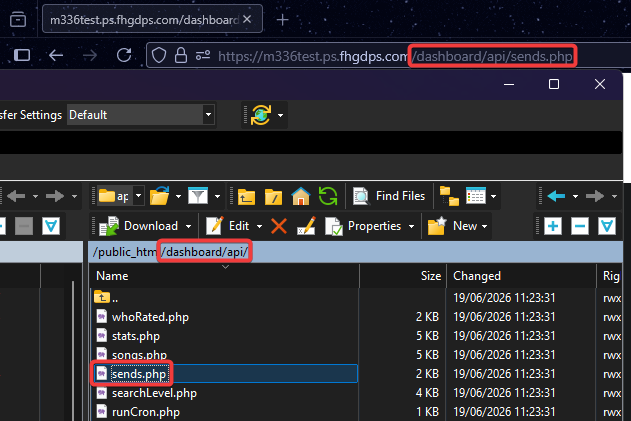

L'indicateur "Sent" de [Level Info](https://geode-sdk.org/mods/m336.levelinfo) ne fonctionne pas nativement sur les GDPSs et nécessite donc une configuration manuelle. Ce guide explique donc comment le configurer !

*Pour l'instant, Level Info ne supporte que "partiellement" cette méthode. Les niveaux non suggérés afficheront "Failed", tandis que les niveaux suggérés afficheront "Sent".*

## Trouver l'endpoint sends de votre GDPS
Premièrement, trouvez l'URL complète de votre endpoint `sends.php`. Il se trouve généralement à `dashboard/api`.

**Exemple:** `https://m336test.ps.fhgdps.com/dashboard/api/sends.php`

## Configurer l'URL des sends personnalisé
Ensuite, allez dans les paramètres de Level Info et cherchez le paramètre "Custom Sends Endpoint". Collez l'URL que vous avez trouvée précédemment, et ajoutez `?level=` à la fin

**Exemple:** `https://m336test.ps.fhgdps.com/dashboard/api/sends.php?level=`

## Appliquez le changement
Enfin, enregistrez/appliquez le changement. L'indicateur "Sent devrait maintenant fonctionner à nouveau !

-----

*Dernièrement mis à jour : 14 Juillet 2026*