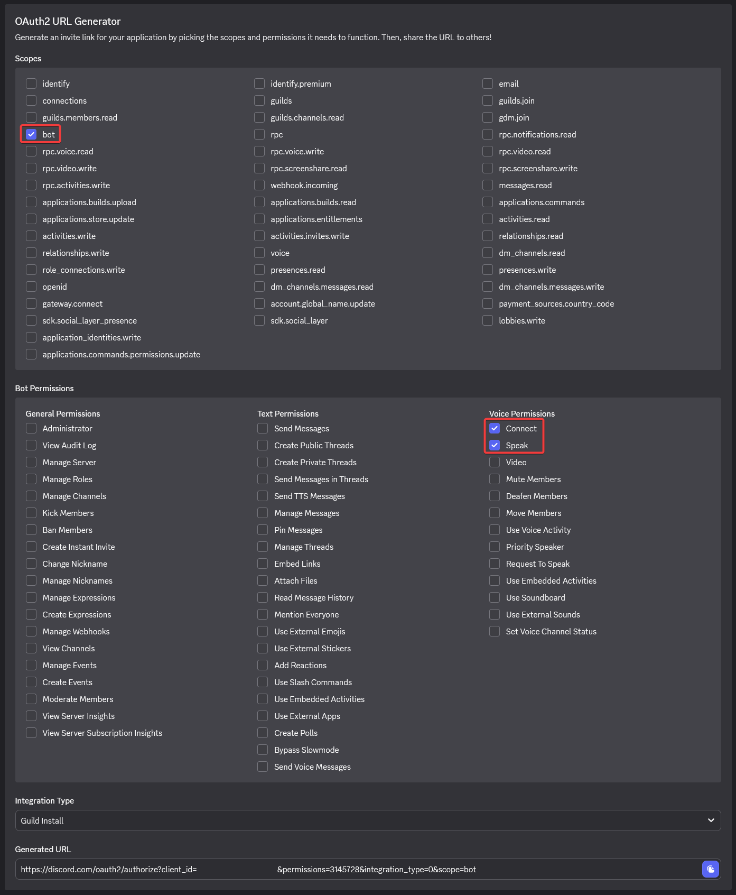
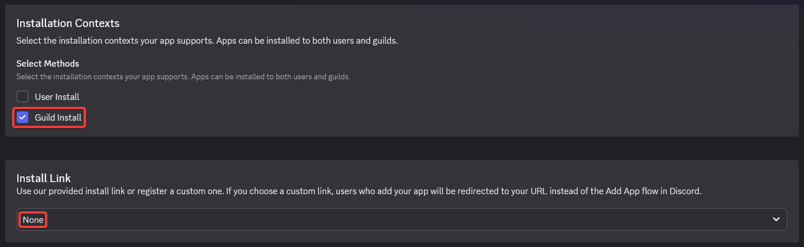
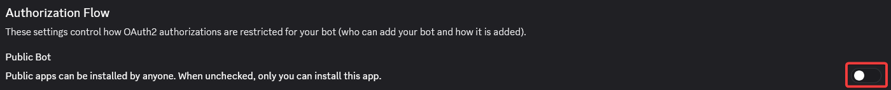

Si vous ne savez pas ce qu'est un bot radio, c'est simplement un bot Discord qui diffuse de la musique 24/7 dans un salon que vous avez choisi. Ce guide vous expliquera comment en avoir un qui jouera des musiques aléatoires de votre GDPS !

## Prérequis
Pour suivre ce guide, vous aurez besoin de :
- Une machine capable de tourner 24h/7
- Avoir [Bun](https://bun.sh) installé
- Un accès complet au SFTP de votre GDPS et à votre serveur Discord (avec les permissions d'administrateur pour ajouter le bot)
- Une connexion internet stable

## Créer le bot
Créez une **application Discord** puis un **bot Discord** depuis le [Discord Developer Portal](https://discord.com/developers/applications), ensuite :

- Copiez le token du bot (vous en aurez besoin pour le fichier `.env`)
- Dans le **OAuth2 URL Generator**, sélectionnez `bot` puis les permissions `Connect` et `Speak`
- Générez le lien d'invitation et ajoutez le bot à votre serveur



## Ajouter l'endpoint pour le bot
Créez un fichier `randomSong.php` n'importe où sur le SFTP de votre GDPS **(n'oubliez pas de remplacer la ligne `require "chemin/vers/incl/lib/connection.php";` par le bon chemin sur votre serveur)** :
```php
<?php
header("Content-Type: application/json");
header("Access-Control-Allow-Origin: *");
header("Access-Control-Allow-Methods: GET");

require "chemin/vers/incl/lib/connection.php"; // Changez le chemin à cette ligne !

$song = $db->prepare("SELECT * FROM songs WHERE isDisabled = 0 AND download != 'CUSTOMURL' ORDER BY RAND() ASC LIMIT 1");
$song->execute();
$song = $song->fetch();

$data = [
    "ID" => $song["ID"],
    "author" => $song["authorName"],
    "name" => $song["name"],
    "download" => $song["download"],
    "reuploadID" => $song["reuploadID"],
    "reuploadTime" => $song["reuploadTime"]
];

exit(json_encode([
    "dashboard" => true,
    "success" => true,
    "song" => $data
]));
?>
```
*Le fichier doit être publiquement accessible (via HTTP/HTTPS).*

**Exemple:** `https://m336test.ps.fhgdps.com/randomSong.php` (et `require "incl/lib/connection.php";`)

## Télécharger et démarrer le bot
1. [Télécharger le repository](https://github.com/M336G/gdps-radio-bot/archive/refs/heads/main.zip) sur une machine qui peut tourner 24/7 ou clonez-le avec : `git clone https://github.com/M336G/gdps-radio-bot.git`
2. Ensuite, dans son dossier (décompressé), installez les dépendances avec `bun install` et remplissez le fichier `.env` selon vos besoins (voir [.env.example](https://github.com/M336G/gdps-radio-bot/blob/main/.env.example) pour un exemple)
3. Enfin, démarrez le bot avec `bun run start` !

**Assurez-vous que :**
- Le bot soit en ligne sur Discord
- Il joue de la musique dans le salon souhaité

## Empêcher l'invitation du bot par d'autres
Ceci est purement optionnel, car le bot ne fonctionnera pas sur les autres serveurs de toute façon, mais c'est une bonne étape finale pour conclure !

Sur le [Discord Developer portal](https://discord.com/developers/applications), modifiez :
- **Installation Context** en `Guild Install` uniquement (dans la catégorie Installation)
- **Install Link** en `None` (dans la catégorie Installation aussi)
- **Public Bot** en `false` (dans la catégorie Bot)





-----

*Dernièrement mis à jour : 16 Juillet 2026*